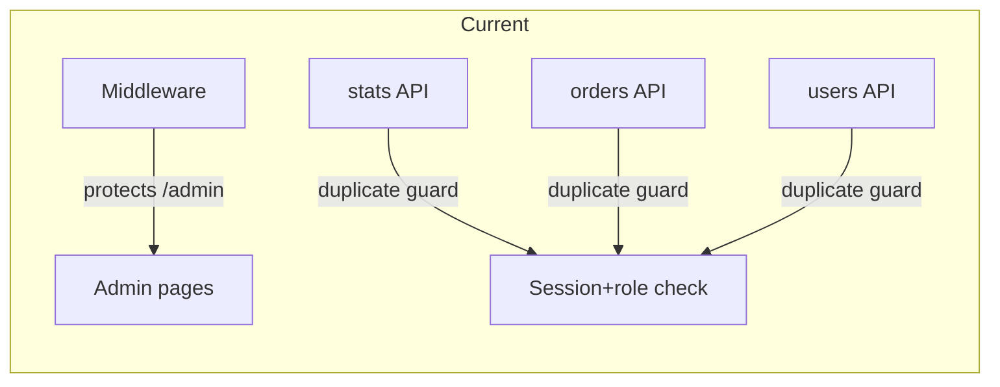

# Admin section improvement plan

## Current state

- **Auth:** Middleware protects `/admin`*; redirects unauthenticated to `/admin-login` and non-admin to `/`. All admin APIs (`/api/admin/stats`, `orders`, `users`) repeat the same guard: `!session || (session.user as any).role !== "admin"`.
- **Admin login:** Always redirects to `/admin`; no `callbackUrl` support.
- **Admin UI:** Dashboard, orders, and users pages do not check `response.status`; 403/401 are not handled.
- **Stats API:** Loads all orders with `Order.find()` then reduces in memory for `totalRevenue` and today’s revenue.
- **Orders PATCH:** Accepts any `status` string; no validation against allowed values. `OrderStatus` is already defined in [src/types/index.ts](src/types/index.ts); Order model uses the same enum in [src/models/Order.ts](src/models/Order.ts).

---

## 1. Centralize admin guard

**Goal:** Single place for “require admin session”; all admin APIs use it so behavior and status codes stay consistent.

- Add a small helper used only by admin API routes. Two options:
  - **Option A (recommended):** Create `src/lib/auth-admin.ts` with something like:
    - `getAdminSession()`: calls `auth()`, returns `{ session }` or `{ error: NextResponse }` (403 Unauthorized). Admin route handlers call it and return `error` when present.
  - **Option B:** A wrapper that takes the request and a handler; it runs `auth()`, checks role, and either returns 403 or calls the handler with session. Slightly more invasive.
- Use this helper in:
  - [src/app/api/admin/stats/route.ts](src/app/api/admin/stats/route.ts)
  - [src/app/api/admin/orders/route.ts](src/app/api/admin/orders/route.ts) (both GET and PATCH)
  - [src/app/api/admin/users/route.ts](src/app/api/admin/users/route.ts)
- Remove the duplicated `(session.user as any).role !== "admin"` logic from those files.

**Outcome:** One implementation of “admin required”; easier to change status codes or add logging later.

---

## 2. Type NextAuth session role

**Goal:** Remove `(session.user as any).role` and get type-safe `session.user.role` across the app.

- Add or extend NextAuth module augmentation (e.g. `src/types/next-auth.d.ts` or inside [src/types/index.ts](src/types/index.ts) if you prefer):
  - Extend `User` to include `role?: "user" | "admin"`.
  - Extend `Session` so `user` includes `role`.
- Ensure the JWT callback in [src/auth.ts](src/auth.ts) continues to set `token.role` and the session callback assigns it to `session.user`; types will then match.
- Replace all `(session.user as any).role` with `session.user.role` in:
  - [src/middleware.ts](src/middleware.ts)
  - All admin API routes (or the new central guard, which will use the typed session).

**Outcome:** No `as any`; safer refactors and clearer intent.

---

## 3. Admin login callbackUrl

**Goal:** After admin login, redirect to the page they tried to open (e.g. `/admin/orders`) when coming from a link.

- In [src/app/admin-login/page.tsx](src/app/admin-login/page.tsx):
  - Read `callbackUrl` from the URL (e.g. `useSearchParams().get("callbackUrl")` or `searchParams` if passed from page props). Default to `"/admin"` when missing.
  - After successful `signIn`, use `router.push(callbackUrl ?? "/admin")` (and ensure the value is under `/admin` to avoid open redirect: e.g. `callbackUrl.startsWith("/admin") ? callbackUrl : "/admin"`).
- In [src/middleware.ts](src/middleware.ts):
  - When redirecting unauthenticated users to admin login, set `searchParams.set("callbackUrl", pathname)` on the redirect URL (same pattern as user login).

**Outcome:** Direct links to `/admin/orders` or `/admin/users` work after login.

---

## 4. Admin pages: handle 403/401

**Goal:** When admin API returns 401/403, show a clear message or redirect instead of generic “Failed to load”.

- In [src/app/admin/page.tsx](src/app/admin/page.tsx) (dashboard): After `fetch("/api/admin/stats")`, if `response.status === 401 || response.status === 403`, redirect to `/admin-login` (or show an “Unauthorized” message and a link to sign in). Only then parse JSON and handle `!data.success`.
- In [src/app/admin/orders/page.tsx](src/app/admin/orders/page.tsx): Same for `fetch("/api/admin/orders")`.
- In [src/app/admin/users/page.tsx](src/app/admin/users/page.tsx): Same for `fetch("/api/admin/users")`.
- Optionally extract a small helper (e.g. `handleAdminResponse(response)`) that does the 401/403 redirect/message and returns whether to proceed, to avoid repeating the same logic in three pages.

**Outcome:** Expired or invalid session results in a clear redirect to admin login instead of a vague error.

---

## 5. Stats API: use aggregation

**Goal:** Stop loading all orders into memory; use MongoDB aggregation for revenue sums.

- In [src/app/api/admin/stats/route.ts](src/app/api/admin/stats/route.ts):
  - Replace `Order.find()` + `reduce` for **total revenue** with a single aggregation: `Order.aggregate([{ $group: { _id: null, total: { $sum: "$totalAmount" } } }])`, then read `result[0]?.total ?? 0`.
  - Replace `Order.find({ createdAt: { $gte: today, $lt: tomorrowStart } })` + `reduce` for **today’s revenue** with an aggregation that filters by `createdAt` and `$sum: "$totalAmount"`.
- Keep `Order.countDocuments()` for `totalOrders` and `pendingOrders`; keep `User.countDocuments()` for `totalUsers`.

**Outcome:** Constant memory usage regardless of order count; better performance at scale.

---

## 6. Orders PATCH: validate status

**Goal:** Only allow status values that exist in the schema and UI; return 400 for anything else.

- Define the allowed list in one place. Recommended: import `OrderStatus` from [src/types/index.ts](src/types/index.ts) and use it, or define a constant array of allowed statuses (e.g. `ALLOWED_ORDER_STATUSES`) that matches the Order model enum in [src/models/Order.ts](src/models/Order.ts).
- In [src/app/api/admin/orders/route.ts](src/app/api/admin/orders/route.ts) PATCH handler:
  - After parsing `orderId` and `status`, if `status` is not in the allowed list, return `NextResponse.json({ error: "Invalid status" }, { status: 400 })`.
  - Then proceed with `findByIdAndUpdate` as today.

**Outcome:** No invalid or typo statuses persisted; clear 400 for bad input.

---

## 7. Admin layout: optional client-side guard

**Goal:** If session is missing or user is not admin while already on an admin page (e.g. session expired or client state odd), redirect instead of showing admin shell.

- In [src/app/admin/layout.tsx](src/app/admin/layout.tsx):
  - Use `useSession()` (already used). If `status === "unauthenticated"`, redirect to `/admin-login` (e.g. `router.replace("/admin-login")`).
  - If `status === "authenticated"` and `session.user.role !== "admin"`, redirect to `/` (or home).
  - Show a minimal loading state (e.g. “Loading…”) while `status === "loading"` so you don’t flash the full admin UI.
- This is a safety net; middleware remains the primary enforcer.

**Outcome:** No brief flash of admin UI for non-admins or logged-out users; consistent redirect behavior on the client.

---

## Implementation order

| Step | Task                                                                                                | Depends on                           |
| ---- | --------------------------------------------------------------------------------------------------- | ------------------------------------ |
| 1    | Add NextAuth role types                                                                             | None                                 |
| 2    | Create `getAdminSession()` in `src/lib/auth-admin.ts` and use it in all three admin API route files | Step 1 (so guard uses typed session) |
| 3    | Add callbackUrl support on admin-login page and middleware redirect                                 | None                                 |
| 4    | Handle 403/401 in admin dashboard, orders, and users pages                                          | None                                 |
| 5    | Refactor stats API to use aggregation for revenue                                                   | None                                 |
| 6    | Validate order status in PATCH using OrderStatus / allowed list                                     | None                                 |
| 7    | Add client-side session/role check and loading state in admin layout                                | Step 1 (for typed role)              |

Steps 1–2 and 3–6 can be done in parallel by file area (types + auth, then routes, then pages). Step 7 last so it benefits from typed session.

---

## Files to touch (summary)

- **New:** `src/lib/auth-admin.ts` (admin session helper); optionally `src/types/next-auth.d.ts` (or extend existing types).
- **Modify:** [src/auth.ts](src/auth.ts) (no logic change if types live in augmentation only), [src/middleware.ts](src/middleware.ts), [src/app/admin-login/page.tsx](src/app/admin-login/page.tsx), [src/app/admin/layout.tsx](src/app/admin/layout.tsx), [src/app/admin/page.tsx](src/app/admin/page.tsx), [src/app/admin/orders/page.tsx](src/app/admin/orders/page.tsx), [src/app/admin/users/page.tsx](src/app/admin/users/page.tsx), [src/app/api/admin/stats/route.ts](src/app/api/admin/stats/route.ts), [src/app/api/admin/orders/route.ts](src/app/api/admin/orders/route.ts), [src/app/api/admin/users/route.ts](src/app/api/admin/users/route.ts).

---

## Out of scope (optional later)

- **Pagination:** Orders and users lists are unbounded; when data grows, add server-side pagination (e.g. `skip`/`limit` or cursor) and optional filters. Not required for this plan.
- **Rate limiting / audit log:** No changes in this plan.
- **Multiple admin users / roles in DB:** Still single admin via env; no DB-backed admin table in this plan.

