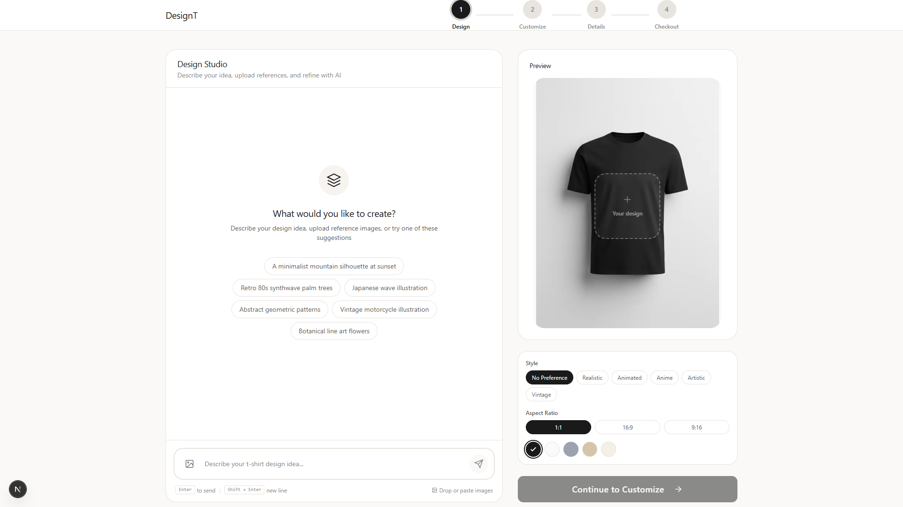

# DesignT - AI-Powered T-Shirt Design Studio

An elegant, chat-based t-shirt design platform that leverages Google's Gemini AI for real-time image generation. Create unique, custom t-shirt designs through natural conversation.

## Screenshots

### Landing Page


### Design Studio


## Features

### AI Design Generation
- **Conversational Interface**: Chat with AI to create and refine designs iteratively
- **Multi-Image Support**: Upload up to 3 reference images per message for style guidance
- **Real-time Preview**: See your designs instantly on t-shirt mockups
- **Design History**: Browse and select from previously generated designs

### Product Customization
- **5 T-Shirt Colors**: White, Black, Navy, Heather Grey, Sand
- **8 Sizes Available**: XS through 3XL with detailed measurements
- **Position Controls**: Adjust vertical placement and scale of your design
- **Live Preview**: Real-time updates as you customize

### Premium E-Commerce Flow
- **4-Step Checkout**: Design → Customize → Details → Payment
- **Razorpay Integration**: Secure payment processing
- **COD Support**: Cash on delivery option with nominal fee
- **Order Tracking**: Complete order management system

## Tech Stack

| Category | Technology |
|----------|------------|
| Framework | Next.js 16 (App Router) |
| Styling | Tailwind CSS |
| State Management | Zustand with persistence |
| AI Generation | Google Gemini API |
| Database | Supabase (PostgreSQL) |
| Image Storage | Cloudinary |
| Payments | Razorpay |
| Deployment | Vercel |

## Project Structure

```
src/
├── app/
│   ├── layout.tsx              # Root layout with fonts
│   ├── page.tsx                # Landing page
│   ├── globals.css             # Global styles & CSS variables
│   ├── studio/
│   │   ├── page.tsx            # Step 1: AI Design Studio
│   │   ├── customize/page.tsx  # Step 2: Product customization
│   │   ├── details/page.tsx    # Step 3: Customer information
│   │   └── checkout/page.tsx   # Step 4: Payment
│   ├── order/[id]/page.tsx     # Order confirmation
│   └── api/
│       ├── generate-design/    # Gemini AI integration
│       ├── remove-background/  # Background removal
│       ├── upload-image/       # Cloudinary upload
│       ├── orders/             # Order management
│       └── payment/            # Razorpay integration
├── components/
│   ├── ui/                     # Reusable UI components
│   ├── layout/                 # Header, Footer, Container
│   ├── studio/                 # Design studio components
│   ├── checkout/               # Checkout components
│   └── landing/                # Landing page sections
├── stores/
│   ├── useDesignStore.ts       # Design state
│   ├── useProductStore.ts      # Product options
│   ├── useConversationStore.ts # Chat history
│   ├── useCustomerStore.ts     # Customer details
│   └── useOrderStore.ts        # Order state
├── lib/
│   ├── supabase/               # Database client
│   ├── gemini.ts               # AI utilities
│   ├── cloudinary.ts           # Image upload
│   └── razorpay.ts             # Payment utilities
├── types/                      # TypeScript definitions
├── constants/                  # App constants
└── hooks/                      # Custom React hooks
```

## Getting Started

### Prerequisites

- Node.js 18+
- npm or yarn
- Google Cloud account (for Gemini API)
- Supabase account
- Cloudinary account
- Razorpay account (for payments)

### Installation

1. **Clone the repository**
   ```bash
   git clone https://github.com/Edwinswanith/DesignT.git
   cd DesignT
   ```

2. **Install dependencies**
   ```bash
   npm install
   ```

3. **Set up environment variables**

   Create a `.env.local` file in the root directory:
   ```env
   # Google Gemini API
   GEMINI_API_KEY=your_gemini_api_key

   # Supabase
   NEXT_PUBLIC_SUPABASE_URL=your_supabase_url
   NEXT_PUBLIC_SUPABASE_ANON_KEY=your_supabase_anon_key
   SUPABASE_SERVICE_ROLE_KEY=your_service_role_key

   # Cloudinary
   CLOUDINARY_CLOUD_NAME=your_cloud_name
   CLOUDINARY_API_KEY=your_api_key
   CLOUDINARY_API_SECRET=your_api_secret

   # Razorpay
   NEXT_PUBLIC_RAZORPAY_KEY_ID=your_razorpay_key_id
   RAZORPAY_KEY_SECRET=your_razorpay_secret
   ```

4. **Run the development server**
   ```bash
   npm run dev
   ```

5. **Open your browser**

   Navigate to [http://localhost:3000](http://localhost:3000)

## API Routes

### POST `/api/generate-design`

Generate t-shirt designs using Gemini AI.

**Request Body:**
```json
{
  "contents": [
    {
      "role": "user",
      "parts": [
        { "text": "Create a minimalist mountain design" },
        { "inlineData": { "mimeType": "image/png", "data": "base64..." } }
      ]
    }
  ],
  "aspectRatio": "1:1"
}
```

**Response:**
```json
{
  "success": true,
  "text": "Here's your mountain design!",
  "image": {
    "data": "base64_encoded_image",
    "mimeType": "image/png"
  }
}
```

### POST `/api/orders`

Create a new order.

### POST `/api/payment/create`

Initialize Razorpay payment.

### POST `/api/payment/verify`

Verify payment signature.

## Design System

### Typography
- **Headlines**: Instrument Serif (elegant editorial)
- **Body**: Manrope (warm geometric sans-serif)

### Color Palette
```css
--brand-black: #0a0a0a;
--brand-charcoal: #1a1a1a;
--brand-cream: #f7f4f0;
--surface-default: #faf9f7;
--border-default: #e8e4df;
--accent-success: #2d6a4f;
--accent-error: #c9184a;
```

### T-Shirt Colors
| Name | Hex Code |
|------|----------|
| White | `#FFFFFF` |
| Black | `#1a1a1a` |
| Navy | `#1e3a5f` |
| Heather Grey | `#9ca3af` |
| Sand | `#d4c5b5` |

## Pricing

| Item | Price |
|------|-------|
| Base T-Shirt | INR 899 |
| GST (5%) | Calculated |
| Shipping | Free |
| COD Fee | +INR 50 |
| Prepaid Discount | -INR 50 |

## Development

### Running Tests
```bash
npm run test
```

### Building for Production
```bash
npm run build
```

### Linting
```bash
npm run lint
```

## Deployment

### Vercel (Recommended)

1. Push your code to GitHub
2. Import the repository in Vercel
3. Add environment variables in Vercel dashboard
4. Deploy

### Manual Deployment

```bash
npm run build
npm start
```

## Contributing

1. Fork the repository
2. Create a feature branch (`git checkout -b feature/amazing-feature`)
3. Commit your changes (`git commit -m 'Add amazing feature'`)
4. Push to the branch (`git push origin feature/amazing-feature`)
5. Open a Pull Request

## License

This project is licensed under the MIT License - see the [LICENSE](LICENSE) file for details.

## Acknowledgments

- [Google Gemini](https://ai.google.dev/) for AI image generation
- [Next.js](https://nextjs.org/) for the React framework
- [Tailwind CSS](https://tailwindcss.com/) for styling
- [Zustand](https://zustand-demo.pmnd.rs/) for state management
- [Razorpay](https://razorpay.com/) for payment processing

---

Built with care for the Chennai/Tamil Nadu market.
