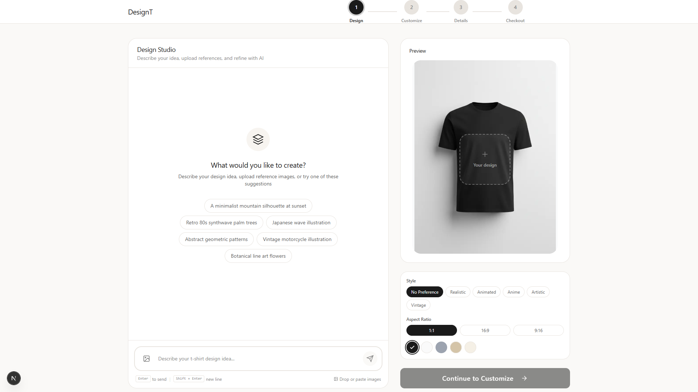
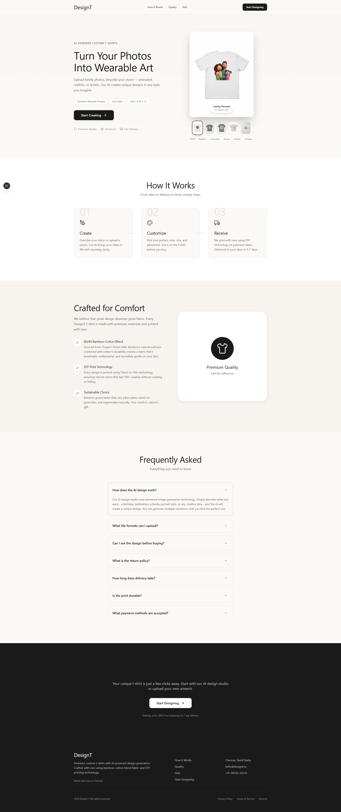

# DesignT - AI-Powered T-Shirt Design Studio

Transform your ideas into wearable art with our intelligent design platform. Create unique, custom t-shirt designs through natural conversation with AI, powered by Google's Gemini technology.

## 🎨 What Makes DesignT Special

**Conversational Design Creation** - Simply describe your vision and watch it come to life  
**Multi-Modal Input** - Upload reference images alongside text prompts for precise style guidance  
**Real-Time Visualization** - See your designs instantly rendered on high-quality t-shirt mockups  
**Intelligent Iteration** - Refine and perfect your designs through natural dialogue  

## 📸 Platform Preview

### Intuitive Design Studio

*Chat-based design creation with real-time preview*

### Seamless Shopping Experience  

*Clean, modern interface focused on creativity*

## ⚡ Core Features

### AI-Powered Design Engine
- **Natural Language Processing**: Describe designs in plain English
- **Visual Reference Support**: Upload up to 3 images per conversation
- **Style Transfer**: Apply artistic styles from reference materials
- **Design Memory**: Access your complete creation history
- **Iterative Refinement**: Perfect designs through conversation

### Product Customization Suite
- **Premium T-Shirt Selection**: 5 carefully curated colors
- **Complete Size Range**: XS to 3XL with detailed fit guides
- **Precision Positioning**: Fine-tune design placement and scale
- **Live Preview Engine**: See changes instantly across all variants

### Professional E-Commerce
- **Streamlined 4-Step Flow**: Design → Customize → Details → Payment
- **Secure Payment Gateway**: Razorpay integration with multiple options
- **Flexible Delivery**: Prepaid discounts or COD convenience
- **Order Management**: Complete tracking and status updates

## 🛠 Technology Architecture

### Frontend Stack
- **Framework**: Next.js 15 with App Router
- **Styling**: Tailwind CSS with custom design system
- **State**: Zustand with localStorage persistence
- **TypeScript**: Full type safety throughout

### Backend & Services
- **AI Engine**: Google Gemini Pro Vision API
- **Database**: Supabase (PostgreSQL)
- **Media Storage**: Cloudinary with optimization
- **Payments**: Razorpay with webhook verification
- **Hosting**: Vercel with edge functions

### Development Tools
- **Package Manager**: npm/yarn
- **Code Quality**: ESLint + Prettier
- **Version Control**: Git with conventional commits
- **Deployment**: Automated CI/CD via Vercel

## 📁 Project Architecture
